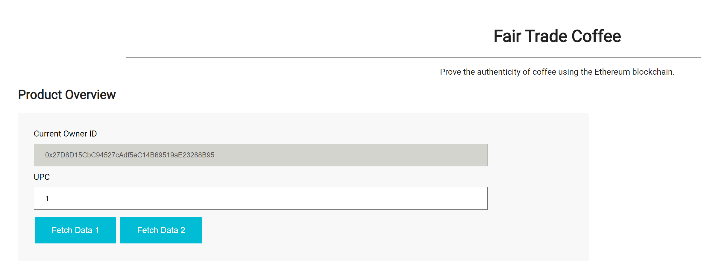
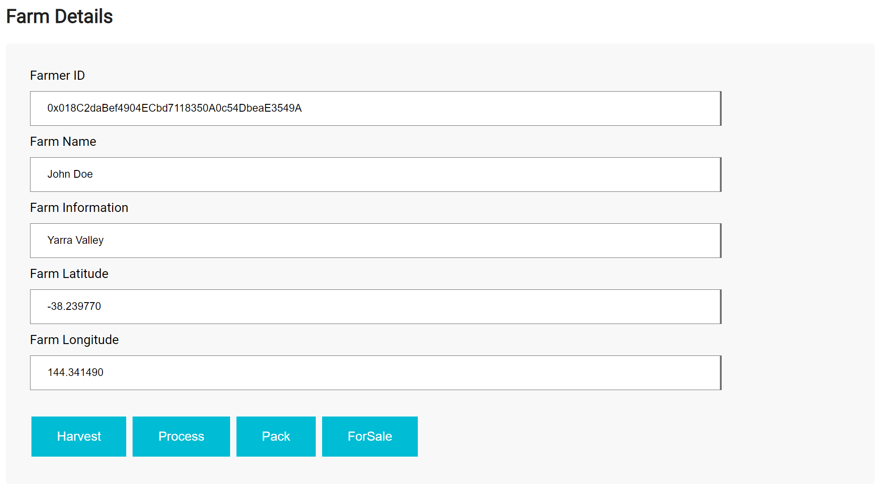
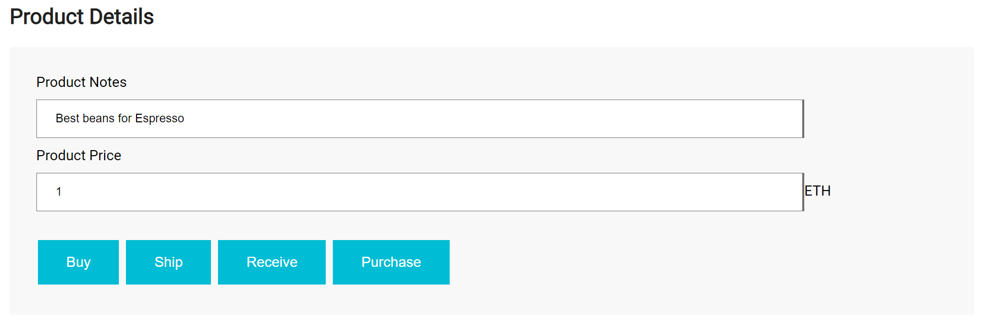

# Supply chain & data auditing

This repository contains an Ethereum DApp that demonstrates a Supply Chain flow between a Seller and Buyer. The user story is similar to any commonly used supply chain process. A Seller can add items to the inventory system stored in the blockchain. A Buyer can purchase such items from the inventory system. Additionally a Seller can mark an item as Shipped, and similarly a Buyer can mark an item as Received.

The public test contract can be found on the Rinkeby Network at:

[Test Supply Chain](https://rinkeby.etherscan.io/address/0x8dde080cb5c61d6551349d96d46eda38428055ca)

The DApp User Interface when running should look like...

## Product Overview



## Farm Details



## Product Details



## Sample Transaction History


## Getting Started

These instructions will get you a copy of the project up and running on your local machine for development and testing purposes. See deployment for notes on how to deploy the project on a live system.

### Prerequisites

Please make sure you've already installed ganache-cli, Truffle and enabled MetaMask extension in your browser.

```
Give examples (to be clarified)
```

### Installing

A step by step series of examples that tell you have to get a development env running

Clone this repository:

```
git clone https://github.com/Sriharish/CoffeeChain.git
```

Change directory to ```project-6``` folder and install all requisite npm packages (as listed in ```package.json```):

```
cd project-6
npm install
```

Launch Ganache:

```
ganache-cli -m "spirit supply whale amount human item harsh scare congress discover talent hamster" --gasLimit 999999999
```

Your terminal should look something like this:


In a separate terminal window, Compile smart contracts:

```
truffle compile
```

Your terminal should look something like this:


This will create the smart contract artifacts in folder ```build\contracts```.

Migrate smart contracts to the locally running blockchain, ganache-cli:

```
truffle migrate
```

Your terminal should look something like this:


Test smart contracts:

```
truffle test
```

All 10 tests should pass.


In a separate terminal window, launch the DApp:

```
npm run dev
```

## Built With

* [Ethereum](https://www.ethereum.org/) - Ethereum is a decentralized platform that runs smart contracts
* [web3.js](https://web3js.readthedocs.io/en/v1.2.8/) - A collection of libraries which allow you to interact with a local or remote Ethereum node, using a HTTP or IPC connection.
* [Truffle Framework](http://truffleframework.com/) - Truffle is the most popular development framework for Ethereum with a mission to make your life a whole lot easier.


## Authors

See also the list of [contributors](https://github.com/your/project/contributors.md) who participated in this project.

## Acknowledgments

* Solidity
* Ganache-cli
* Truffle
* IPFS
